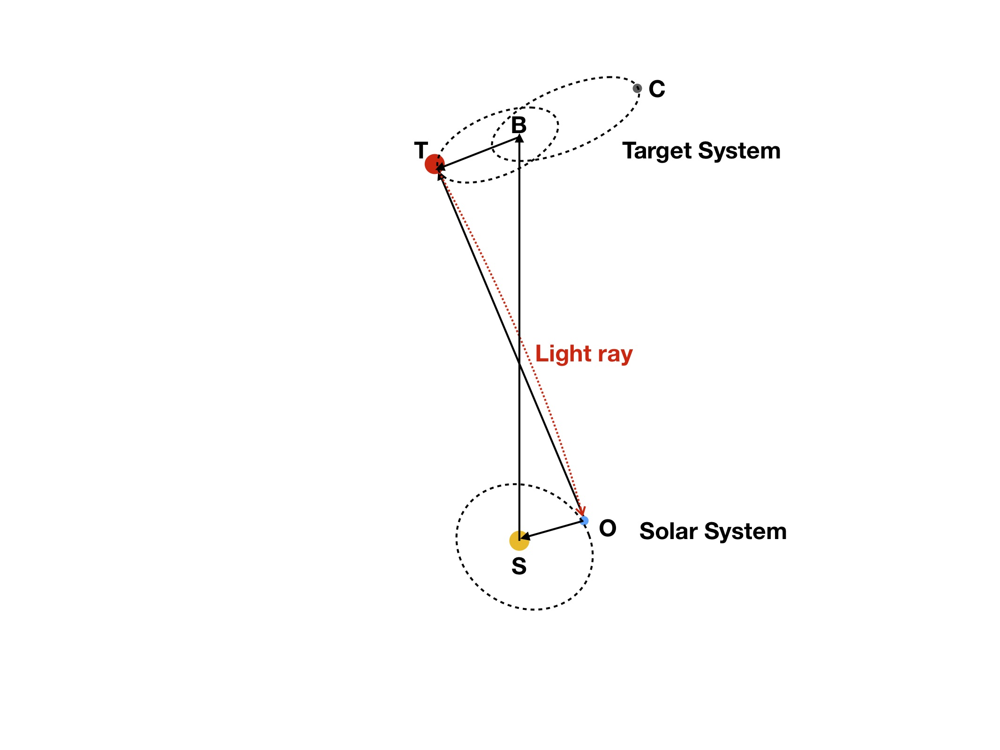

```{r setup, include = FALSE}
library(ggplot2)
library(dplyr)
```

# Introduction
PEXO is a package for making precise exoplanetology. As compared with previous models and packages, PEXO is significantly advanced and accounts for the orbital dynamics of binary motion and stellar reflex motions induced by planetary companions. PEXO treats both classic and relativistic effects such as the Roemer, Shapiro, and Einstein time delays both in the Solar System and in the target system

PEXO is able to model timing to a precision of 1 ns, astrometry to a precision of 1 microarcsecond, and radial velocity to a theoretical precision of 1 $\mu$m/s and a realistic precision of 1 cm/s. PEXO was bechmarked with the pulsar timing package TEMPO2. Theoretical and computational details of the code are described in the paper by Feng et al (2019). 

# Installation
The code is written in R and depends on several libraries. To install R on Linux, download it [here](https://cran.r-project.org/mirrors.html) or, in Ubuntu:

```
sudo apt-get install r-base
```

in MacOS:

```
brew install r
```
Clone this repository:
```
git clone https://github.com/phillippro/pexo.git
```

Install missing R libraries "cd pexo" then 
```
Rscript install_dependencies.R
```
(might require su privileges to be installed):
or just install them manually using install.packages('package_name') in R console.

# Usage
## Command Line
To use PEXO, one needs to go to the directory `pexo/code/` and run command lines such as
```
Rscript pexo.R -m emulate -c TR -t xxx.tim -p xxx.par
```
The command line arguments are listed as follows. 

 Short name | Full name | Meaning
--------- | ---------- | ----------------------------------------------
-m | \-\-mode | PEXO mode: emulate or fit [optional; default=`emulate`]
-c | \-\-component | PEXO model component: timing (`T`), astrometry (`A`), radial velocity (`R`) and their combinations [optional; default=`TAR`]
-t | \-\-time | Two options are possible. 1. Timing file: epochs or times could be in 1-part or 2-part JD[UTC] format; 2. Format of `"Start End By"` [mandatory if mode=emulate]
-p | \-\-par | Parameter file: parameters for models, observatory, for Keplerian/binary motion [mandatory]
-v | \-\-var | Output variables [optional; default=`NULL`]
-o | \-\-out | Output file name: relative or absolute path [optional; default=`out.txt`]
-f | \-\-figure | Output figure and verbose: FALSE or TRUE [optional; default= `TRUE`]

Since the astrometry and radial velocity modeling depends on the the output of timing model, `T` should always be included in the `-c` or `--component` argument. 

## Input timing data
The `-t` argument is mandatory could either be a timing file or a string with `"Start End By"` format. 

The timing file could be two-part or one-part JD or MJD (MJD=JD-2400000.5) in UTC time standard. The former can store epochs with precision of $10^{-14}$ second while the the latter can store epoch with precision of $10^{-6}$ second or microsecond in a 64-bit computer. 

The `"Start End By"` format timing argument is composed of the start epoch (`Start`), the end epoch (`End`) and the time step (`By`). For example, a run of PEXO with `-t "2456640.5 2458462.5 0.5"` will simulate the system from JD2456640.5 to JD2458462.5 by a time step of 0.5 days. The -t argument could also be in MJD format such as `-t "56640 58462 0.5"`. The times generated from the sequence would be transformed into 2-part JD format for high precision emulation. 

## Input parameters
The other mandatory argument is the parameter file which provides the values of input parameters. We list these parameters and their meanings in the following table. The bold-faced values are default ones. If there is no default value for a given parameter, it should be given manually and an example value is provided for reference in the `options or examples` column. 

parameter | unit | options or examples | meaning
-------------- | ---------- |  --------------------------- | ----------------------------------------------
name | -| **First five characters of parameter file name**, any string | name of the target
RefType | -| **none**, refro, refco, refcoq | computation method for atmospheric refraction 
EopType | -|**2006**, 2000B | type of Earth rotation model and corresponding Earth orientation parameters
TaiType |-|**instant**, scale| UTC to TAI method
TtType |-|**BIPM**, TAI| TAI to TT method
unit |-|**TCB**, TDB| output quantities compatible with TCB or TDB time standard
DE |-|**430**, 430t, 438, ... | JPL ephemerides
TtTdbMethod |-|**eph**, FB01, FBgeo |TT to TDB method
SBscaling|-|**FALSE**, TRUE| linear scaling between tB and tS due to relativistic effects
PlanetShapiro |-|**TRUE**, FALSE| planetary shapiro delay
CompareT2|-|**FALSE**, TRUE| calculate uSB using TEMPO2 method for comparison
RVmethod|-|**analytical**, numerical | the method used for RV modeling, numerical is used only for comparison
LenRVmethod | - | **T2**, PEXO | the method used to derive RV lensing, T2 is used by default to be consistent with shapiro delay model in PEXO
BinaryModel|-|**none**, DDGR, kepler| binary model
ellipsoid |-|**WGS84**, GRS80, WGS72| ellipsoidal (normal) Earth Gravitational Model  
epoch |JD or MJD|2448349.06250|epoch when the astrometry and position of the target is measured
observatory|-|CTIO|observatory name
|||
xtel|metre | 1814985.3| geocentric position of the telescope in the International Terrestrial Reference Frame (ITRF)
ytel |metre|-5213916.8| geocentric position of the telescope in ITRF
ztel |metre|-3187738.1| geocentric position of the telescope in ITRF
tdk |K|278| ambient temperature at the observer
pmb |millibar|1013.25|pressure at the telescope
rh |-|0.1| relative humidity at the observer (range 0-1)
wl |$\mu$m|0.5| effective wavelength of the source 
tlr|K/metre|**0.0065**, any value>0|Temperature lapse rate in the troposphere 
g ||**1**, 0, any other values >0 |one of the PPN parameters
mT |$M_\odot$|1.1055|target mass
mC |$M_\odot$|0.9373|companion mass
ra |degree|219.9175253|right ascension (RA) of the barycenter (TSB)
dec |degree|-60.8371344|declination (DEC) of the barycenter (TSB)
plx |mas|747.1700008|parallax of the barycenter (TSB)
pmra |mas/yr|-3649.4980522|proper motion in RA of the barycenter (TSB)
pmdec |mas/yr|624.7691720|proper motion in DEC of the barycenter (TSB)
rv |km/s|-22.3929553|radial velocity of the barycenter (TSB)
aT  |au|10.80332|semi-major axis of the barycentric motion of the target
P |year|79.929|orbital period of the target
e |-|0.5208|eccentricity
I |degree| 79.32|inclination
omegaT |degree|52.006|argument of periastron
Omega |degree|205.064|longitude of ascending node
Tp |JD or MJD|2435328.96|periastron epoch

In the above table, from `name`  to `observatory` are non-fitable parameters which are mainly used for solar system ephemeris and the modeling of Earth rotation. The other parameters are fitable although we have not implemented the fitting part of PEXO. `epoch` is the time when the position and astrometry of the target sysstem is measured. It is `tpos` defined in the PEXO paper. 

### Observatory data

PEXO will first look for observatory data by finding `xtel`, `ytel`, and `ztel` from the parameter file. If it does not find these parameters, it will look for `elong` (longitude in degree), `phi` (latitude in degree) and `height` (altitude in km). If these parameters are not given, PEXO will look for the observatory name (`observatory`) and code (`ObsCode`). It will look for the observatory data in `observatories/observatory_MPC.csv` or in `observatories/satellite_list.csv`. 
For space-based observatory, the atmospheric refraction and delay are zero and would not be implemented by PEXO. For ground-based telescope, the `RefType` parameter should be `refro` (recommended), `refco`, or `refcoq` for the calculation of refraction in astrometry modeling. If `RefType` is `none`, the atmospheric refraction is zero. The tropospheric delay and its time derivative are automatically implemented for ground-based observatories and thus do not depend on the choice of `RefType`. 

For space-based observatory, "code/GetSpaceObsEph.py" will be used to find the telescope's ephemerides. So you need to install python as well as python packages `sys`, `astropy`, `numpy`, and `astroquery`. 

### Binary or Keplerian model parameters
The five orbital parameters for a binary motion should be specified if the target system is a binary. If `BinaryModel` is `none`, PEXO treats the target system as a single-star system. If `BinaryModel` is `DDGR` or `kepler`, PEXO will look for Keplerian parameters. The target is denoted by `T` and companion by `C`. The mass of T is `mT`, the mass of C is `mC` and the mass of the whole system is `mTC`. Two of them should be given for binary simulations. The semi-major axis of the barycrentric orbit of T is `aT`, that of C is `aC`, and that of the binary orbit of C with respect to T is `aTC`. Either the orbital period `P` or one of the semi-major axes `aT`, `aC`, or `aTC` should be given to determine the binary orbit. If one of them is given, the other parameters will be derived. 
Either the periastron epoch `Tp`, or the mean anomaly `M0` at the reference epoch `T0`, or the primary transit epoch `Tc` should be given to determine the binary orbit. If one of them is given, the others will be derived. 

### TDB-TT computation method
There are three methods which can provide high-precision conversion from TT to TDB: `eph`, `FB01`, and `FBgeo`. The `eph` method is the most precise one because it uses the JPL ephemeries of TDB-TT. If one use `eph` method and choose ephermides which has corresponding version (with `t`) with timing ephemeries, PEXO would look for the `t` version. If there is no `t` version downloaded, it would use `FBgeo` which is the 1990 verion of the FB method calculating TDB-TT at the geocenter [(Fairhead & Bretagnon 1990)](http://adsabs.harvard.edu/abs/1990A%26A...229..240F). For example, if one use DE430, PEXO would use DE430t to determine TDB-TT. If PEXO cannot find DE430t, it will use FBgeo to calculate TDB-TT. 

If there is no `t` versions downnloaded, PEXO would use the `FBgeo` method by default. The 2001 version of FB method (`FB01`) is more advanced than `FBgeo`. To use `FB01` to convert TT to TDB,  one needs to install `gfortran` and compile the fortran routine `code/FB01/fb2001.f` written by Alan W. Irwin to read `fb2001.dat` using the following command line in `code/FB01`: 

```gfortran -O2 fb2001.f -o fb2001```

. Although this is automatically implemented in PEXO, the compiler of fb2001.f should be checked if an error occures when using the FB01 method. All TDB-TT methods are precise to a few nanoseconds. 

## Output 

### Output variables 
A diagram for propagation of the light ray from the target star to the observer is shown below to aid the understanding of the ouptut quantities. 
<center>

Fig. 1. Illustration of a light ray emitted from the target (T) and observed by the observer (O). The target system is composed of the target (T) and its companion (C). The binary barycenter is denoted by B. The observer is in the solar system with a barycenter at S. 
</center>

There are outputs from four functions in PEXO:
```
OutBary <- time_Utc2tb(utc,Par)
```
`utc` is the input 2-part JD epochs, `Par` is the input and derived parametes. The output `OutBary` is a list of variables related to the transformation from JD[UTC] to JD[TCB] or JD[TDB]. 

```
OutTime <- time_Ta2te(OutBary,Par)
```
This function uses OutBary and Par to transform JD[TCB] to BJD[TCB] to light emission time. Thus `OutBary` and `OutTime` are the outputs from the timing models. 

```
OutAstroT <- astro_FullModel(OutBary,OutTime,Par,Mlens=Par$mC,component='T')
OutAstroC <- astro_FullModel(OutBary,OutTime,Par,Mlens=Par$mT,component='C')
```
`OutAstroT` and `OutAstroC` are outputs of the astrometry modeling of the T and C component in the target system. Since the astrometry function `astro_FullModel` calls OutBary and OutTime, these astrometry outputs depend on outputs of timing model. 

```
OutRv <- rv_FullModel(OutBary,OutTime,Par)
```
`OutRv` is the output of radial velocity modeling and also depends on the outputs of timing model. 

These output lists will be combined as `OutAll` to be saved as ascii file if the output variables `-v` are specified in the command line. 

We list the output variables in `OutAll`, their unit and meaning in the following table. 

variable | unit | meaning
------------ | ------- | ------------------------------------------
AbeTarget | second | target aberration delay
BJDtcb | day | BJD[TCB]
BJDtdb | day | BJD[TDB]
BT | au; au/yr | Position and velocity vectors from TSB to T
DefEarth | rad | Deflection vector due to Earth lensing
DefJupiter| rad | Deflection vector due to Jupiter lensing
DefMars| rad | Deflection vector due to Mars lensing
DefMercury| rad | Deflection vector due to Mercury lensing
DefMoon| rad | Deflection vector due to Moon lensing
DefNeptune| rad | Deflection vector due to Neptune lensing
DefSaturn| rad | Deflection vector due to Saturn lensing
DefSun| rad | Deflection vector due to Sun lensing
DefUranus| rad | Deflection vector due to Uranus lensing
DefVenus| rad | Deflection vector due to Venus lensing
delevation | rad/day | time derivative of elevation angle
delevationT2 | rad/day | time derivative of elevation angle computed by TEMPO2 method
DirObs | rad | observed right ascension and declination of the target
dl.all | rad | Light deflection vector due to all effects
dl.woRef | rad | Light deflection vector due to all effects except for atmospheric refraction
dTCB.dTT | - | dTCB/dTT
dTDB.dTT | - | dTDB/dTT
dzenith | rad/day | Time derivative of zenith: dzenith/dt
EinsteinIS | second | Einstein delay due to relative motion between TSB and SSB
EinsteinTarget | second | Einstein delay in the target system
elevation | rad | elevation angle
elevationT2 | rad | elevation angle calculated using TEMPO2 method
emrat | - | Earth-Moon mass ratio
Eph | - | a list of ephermerides of solar system objects
EphEarth | km; km/s | Earth ephemeris in the Barycentric celestial reference system (BCRS) frame; units are denoted by columns names
EphJupiter | km; km/s | Jupiter ephemeris in BCRS
EphMars| km; km/s | Mars ephemeris in BCRS
EphMercury| km; km/s | Mercury ephemeris in BCRS
EphMoon| km; km/s | Moon ephemeris in BCRS
EphNeptune| km; km/s | Neptune ephemeris in BCRS
EphSaturn| km; km/s | Saturn ephemeris in BCRS
EphSun| km; km/s | Sun ephemeris in BCRS
EphUranus| km; km/s | Uranus ephemeris in BCRS
EphVenus| km; km/s | Venus ephemeris in BCRS
GM | km; km/s | Position and velocity vector from the geocenter to the Moon
GO | km; km/s | Position and velocity vector from the geocenter to the observer/telescope
JDtai | JD | JD[TAI] or TAI
JDtcb | JD | JD[TCB] or TCB
JDtcg | JD | JD[TCG] or TCG
JDtdb | JD | JD[TDB] or TDB
JDtt | JD | JD[TT] or TT
JDut1 | JD | JD[UT1] or UT1
leap | second | leap second
li | - | unit vector or direction of the incident or pre-refraction light ray
limll | - | li - ll
ll | - | direction of the light ray after leaving the target system
llmle | - | ll - le
lo | - | direction of the light ray at the telescope before being observed
lomli | - | lo-li
MO | km; km/s | Position and velocity vector from the Moon to the observer 
OffAbe | arcsecond | offset due to aberration in (dRA*, dDEC)
OffAbe1 | arcsecond | offset due to first-order aberration 
OffAbe2 | arcsecond | offset due to second-order aberration 
OffAll | arcsecond | offset due to all effects 
OffLenS | arcsecond | offset due to all lensing in the solar system  
OffLenT | arcsecond | offset due to all lensing in target system  
OffRef | arcsecond | offset due to atmospheric refraction  
OL | - | a list of observer to solar system body (lens) vectors
OutBT | - | a list of outputs from binary models
rBT | au | position vector from TSB to T
RBT | au | length of rBT
ref | rad | refraction vector
Ref | rad | refraction angle
rOB | pc | position vector from the observer to the TSB
rOC | pc | position vector from the observer to the companion (C)
Roemer1 | second | first order Roemer delay in the solar system
Roemer2| second | second order Roemer delay in the solar system
Roemer3| second | third order Roemer delay in the solar system
RoemerOrder | second | a combined list of Roemer1, Roemer2 and Roemer3
RoemerSB | second | Roemer delay using SB rather than ST as the reference direction (only for comparison)
RoemerSolar | second | total Roemer delay in the solar system
RoemerT2 | second | Roemer delay calculated using the TEMPO2 method (including the total effects and effects for different terms) 
RoemerTarget | second | Roemer delay in the target system
rOT | pc | position vector from the observer to the target 
rSB | pc | position vector from SSB to TSB 
rSC | pc | position vector from SSB to the companion
rST | pc | position vector from SSB to the target
rTC | au | position vector from the target to the companion
RvBT | m/s | radial velocity for TSB to T
RvGO| m/s | radial velocity for geocenter to observer
RvgsO| m/s | general and special relativistic effect on RV at the observatory or in the solar system
RvgT| m/s | general and special relativistic effect on RV in the target system
RvlO| m/s | lensing RV in the solar system
RvLocal| m/s | all RV effects in the solar system
RvlT| m/s | lensing RV in the target system
RvRemote| m/s | all RV effects in the target system
RvSB| m/s | RV due to motion of TSB w.r.t. SSB
RvSG| m/s | RV due to motion of the geocenter w.r.t. SSB
RvSO| m/s | RV due to motion of the observer w.r.t. SSB
RvsT| m/s | special relativitistic effect on RV in the target system
RvST| m/s | RV due to motion of the target w.r.t. SSB
RvTot| m/s | total RV 
RvTropo | m/s | tropospheric RV
SB |pc; au/yr | position and velocity vectors from the SSB to TSB
SG | km; km/s | position and velocity vectors from the SSB to the geocenter
ShapiroEarth | second | Shapiro delay due to Earth
ShapiroJupiter| second | Shapiro delay due to Jupiter
ShapiroMars| second | Shapiro delay due to Mars
ShapiroMercury| second | Shapiro delay due to Mercury
ShapiroMoon| second | Shapiro delay due to Moon
ShapiroNeptune| second | Shapiro delay due to Neptune
ShapiroPlanet| second | a combined list of Shapiro delays due to solar system objects
ShapiroSaturn| second | Shapiro delay due to Saturn
ShapiroSolar| second | Shapiro delay in the solar system
ShapiroSun| second | Shapiro delay due to Sun
ShapiroTarget| second | Shapiro delay in the target system
ShapiroUranus| second | Shapiro delay due to Uranus
ShapiroVenus| second | Shapiro delay due to Venus
SO | km; km/s | position and velocity vectors from the SSB to the observer
SolarDef |rad| deflection angle (vector) due to lensing in the solar system 
SolarDefList|rad| a list of deflection angles due to lensing by solar system objects
TargetDelay|second|total delay in the target system
tauE|JD|proper emission time
tB|JD|coordinate light arrival time at TSB
TDBmTTgeo | second | TDB-TT at the geocenter
TropoDelay | second | tropospheric delay
TropoDelayT2 | second | tropospheric delay calculated using uSB(t=tpos) or ub (see paper) as the reference direction as done in TEMPO2t
tS | JD | same as BJD[TCB]; coordinate ligth arrival time at SSB
U | rad | eccentric anomaly
uBT | - | unit vector for rBT
uo | - | observed direction of the target
uOB | - | unit vector for rOB
uOC | - | unit vector for rOC
uommlo | - | uo+lo
uommlo1 | - | uo+lo1
uommlo2 | - | uo+lo2
uommlo3 | - | uo+lo3
uOT | - | unit vector for rOT
uSB | - | unit vector for rSB
uSB.T2 | - | uSB calculated using the TEMPO2 method (ignoring third order effects)
uST | - | unit vector for rST
VacuumIS | - | vacuum delay in interstellar medium
vBT | au/yr | velocity of T w.r.t. TSB
vGO | km/s | velocity of the observer w.r.t. the geocenter
vOB | au/yr | velocity of TSB to the observer
vOT | au/yr | velocity of target to the observer
vSB | au/yr | velocity of TSB to SSB
vST | au/yr | velocity of the target to SSB
xp | rad | parameter for polar motion of the Earth
yp | rad | parameter for polar motion of the Earth
ZB | -| barycentric correction of Doppler shift
ZBwe | - | barycentric correction of Doppler shift using Wright & Eastman 2014 method
Zcomb | - | combined list of all doppler shifts
ZenIn | rad | zenith angle
ZenInT2 | rad | zenith angle using uSB(t=tpos) or ub (see paper)
zenith | rad | zenith vector
ZgO| - | doppler shift due to general relativistic effect in the solar system
ZgsO| - | doppler shift due to relativistic effects in the solar system
ZgsO.de| - | doppler shift due to relativistic effects in the solar system calculated using JPL ephemerides
ZgSS | - | combined list of gravitational doppler shifts due to solar system objects
ZgsT | - | doppler shift due to relativistic effects in the target system
ZgTk | - | doppler shift due to general relativistic effect in the target system
ZkpO |- | doppler shift due to parallax delay in the solar system
ZkpT|- | doppler shift due to parallax delay in the target system
Zlensing|-| combined list of doppler shifts due to lensing by solar system objects
ZlO | - | doppler shift due to solar system lensing
Zlocal| - | local doppler shift 
ZlT| - | doppler shift due to target system lensing
Zremote| - | local doppler shift 
ZsO| - | special relativistic doppler shift in the solar system
ZSO| - | doppler shift due to the motion of SSB w.r.t. the observer
ZsT | - | special relativistic doppler shift in the target system
ZST | - | doppler shift due to the motion of target w.r.t. SSB
ZST0| - | doppler shift due to the motion of target w.r.t. SSB using uSB.T
ZST0| - | doppler shift due to the motion of target w.r.t. SSB using uSB.T
zTDBmTTgeo|-|doppler shift corresponding to the time derivative of TDB-TT at the geocenter
zTDBmTTobs|-|doppler shift corresponding to the time derivative of the observer term in TDB-TT
zTDBmTTobsR|-|zTDBmTTobs due to rGO
zTDBmTTobsV|-|zTDBmTTobs due to vGO
Ztot|-| total doppler shift
Ztropo|-|tropospheric doppler shift

# Examples

## Use Tau Ceti as an example to compare PEXO with previous packages

The following command line will simulate the Tau Ceti system over 10000 days with a time step of 10 days. It will reproduce the right panel of figure 11 in the paper. 

```
Rscript pexo.R -m emulate -c TR -t ../input/mjd42000to52000by10day.tim -p ../input/TC_Fig11b.par
```

The following output pdf files correspond to the figures in the PEXO paper 

* `../results/timing_E10original_TauCeti_tempoFB90_DE430_ttt2tdbeph_tempo_par4_none.pdf`
   + left panel of Figure 10
   + modified utc2bjd.pro compared with original utc2bjd.pro routine (with bug in parallax delay) based on Eastman 2010 

* `../results/timing_TauCeti_tempoFB90_DE430_ttt2tdbeph_e10_par4_none_originalTRUE.pdf ` 
   + middle panel of Figure 10 
   + timing bias caused by the assumption of zero proper motion in utc2bjd.pro 

* `../results/pexot_TauCeti_tempoFB90_DE430_ttt2tdbeph_e10_par4_none_originalTRUE.pdf` 
   + right panel of Figure 10 
   + timing bias in TEMPO2 due to ignoring third-order Roemer delay and bug in planet shapiro delay
   
* `../results/paper_RV_TauCeti_tempoFB90_DE430_ttt2tdbeph_none.pdf` 
   + right panel of Figure 11 
   + barycentric velocity compuated using PEXO compared with TEMPO2
   
* ` ../results/Sun_TauCeti_tempoFB90_DE430_ttt2tdbeph_par4_none.pdf ` 
   + topleft panel of Figure 8 
   + shapiro delay due to the Sun

* ` ../results/Jupiter_TauCeti_tempoFB90_DE430_ttt2tdbeph_par4_none.pdf ` 
   + topright panel of Figure 8 
   + shapiro delay due to Jupiter
   
* ` ../results/Saturn_TauCeti_tempoFB90_DE430_ttt2tdbeph_par4_none.pdf ` 
   + bottomleft panel of Figure 8 
   + shapiro delay due to Saturn

* ` ../results/Uranus_TauCeti_tempoFB90_DE430_ttt2tdbeph_par4_none.pdf `
   + bottomright panel of Figure 8 
   + shapiro delay due to Uranus

The left panel of figure 11 can be recovered by the following command line. 

```Rscript pexo.R -m emulate -c TR -t ../input/mjd42000to52000by10day.tim -p ../input/TC_Fig11a.par```

The output pdf file  `../results/paper_pexo_vs_T2_TauCeti_tempoFB90_DE430_ttt2tdbeph_Tstep1d_none.pdf`
will show a few $\mu$m/s numerical radial velocity difference between PEXO and TEMPO2. 

## Comparison of JPL ephemerides
The following command line will compare various ephemerides and recover Figure 9 in the paper. There are only DE430 and DE405 ephemerides in the github repository and thus only they will be compared. 

To compare all ephemerides or to use other ephemerides in PEXO, one can download a JPL ephemerides using 

`source download_ephemerides.sh XXX` 

where `XXX` could be any JPL ephemerides such as 438, 438t, 414, ... . The ephemerides would be downloaded into the `pexo/data/` directory. 
```
Rscript compare_ephemeris.R -c TR -t ../input/mjd42000to52000by10day.tim -p ../input/TC_FBgeo.par
```
* `../results/ephemeris_comparison_BJDtdb_tttdbFB01_FALSE.pdf `
  + left panel of Figure 9
  + comparison of BJD[TDB] calculated using various JPL ephemerides

* `../results/ephemeris_comparison_pos_tttdbFB01_FALSE.pdf`
  + middle panel of Figure 9
  + comparison of $r_{SG}$ 
  
* `../results/ephemeris_comparison_vel_tttdbFB01_FALSE.pdf`
  + right panel of Figure 10
  + comparison of $v_{SG}$
  
## $\alpha$ Centauri A and B

The following command line will simulate the alpha Centauri system from MJD42000 to MJD52000 by a step of 10 days. 

`Rscript pexo.R -m emulate -c TA -t ../input/gaia80yrby10day.tim -p ../input/ACAgaia.par`

* `../results/absolute_alphaCenA_astrometry_DDGR_dt10day_Ntime2923_refro.pdf`
  + Figure 14
  + absolute astrometry of alpha Cen A
  
* `../results/relative_alphaCenA_astrometry_DDGR_dt10day_Ntime2923_refro.pdf`
   + Figure 15
   + relative astrometry of alpha Cen B with respect to A
   
The following command line will simulate the radial velocity variation of alpha Centauri A.  
`Rscript pexo.R -m emulate -c TR -t ../input/hip80yrby10day.tim -p ../input/ACAhip.par`

The file `../results/paper_alphaCenA_RV_DDGR_dt10day_Ntime2923_refro.pdf` is the same as Figure 17 in the paper and shows the decomposition of the radial velocity into multiples components due to various effects. 

## PSR J0740+6620

Recently the Shapiro delay of PSR J0740+6620 is measured to a high precision by  [Cromarti et al. 2019](https://www.nature.com/articles/s41550-019-0880-2). PEXO can produce their results by using the reported orbital parameters in the following command line. 

`Rscript pexo.R -c T -t '2456640.5 2458462.5 0.5' -p ../input/PSR_J0740+6620.par`

The output pdf `../results/PSRJ0740+6620_shapiro.pdf` will predict a Shapiro delay matching the one shown in the paper. 
<center>

Fig 2. Shapiro delay of PSR J0740+6620 measured through pulsar timing by Cromarti et al. 2019
</center>

<center>

Fig 3. Shapiro delay of PSR J0740+6620 simulated by PEXO using parameters from Cromarti et al. 2019
</center>

## $\delta$ Del (HD197461)
$\delta$ Del has a well-determined orbit based on astrometric and RV data from [Gardner et al. 2018](https://arxiv.org/pdf/1802.00468.pdf). By using the following command line, one can reproduce the binary orbit. 

`Rscript pexo.R -c TA -t '38300 57600 100' -p ../input/HD197461.par`

Panel P8 in the output file `../results/relative_HD197461_astrometry_DDGR_dt100day_Ntime194_none.pdf` reproduces figure 3 in the original paper. 

<center>
{width=350px}
{width=280px}

Fig. 4. The left panel shows the orbit of $\delta$ Del determined by [Gardner et al. 2018](https://arxiv.org/pdf/1802.00468.pdf) while the right panel shows the orbit simulated by PEXO using the parameters from [Gardner et al. 2018](https://arxiv.org/pdf/1802.00468.pdf). 
</center>

## Barycentric correction of radial velocity
Although PEXO prefer combined modeling of all motions, PEXO provides barycentric correction especially for the high precision radial velocity. Such a correction is reliable for single stars or distant binaries. For single stars, equation 28 of [Wright & Eastman 2014](https://ui.adsabs.harvard.edu/abs/2014PASP..126..838W/abstract) is used to derive barycentric correction of Doppler shift (`ZBwe`). If Keplerian parameters for binary stars are given in the parameter file, PEXO would calculate the total Doppler shift (`Z`) and treat `-Z` as the barycentric Doppler shift (`ZB`). PEXO also computes barycentric correction by accounting for troposheric Doppler shift. 

For example, the following command line would generate an ascii file (`HD10700_bc.txt`) storing a data table for Barycentric Julian Date in TDB time standard (`BJD`) and the barycentric Doppler shift (`ZB`). The Doppler shift should be multipled by the speed of light to get the radial velocity counterpart (RVB). Then the RV corrected from barycentric motion of the Earth is the sum of the measured RV and RVB. 

`Rscript pexo.R -m emulate -c TR -t ../input/HD10700pfs.tim -p ../input/HD10700pfs.par -v 'BJDtdb ZB' -o ../results/HD10700_bc.txt`

The output file would have three columns, first two columns are two-part BJD and the third one is the barycentric Doppler shift. Note that `-c TR` is used because the variables (arguments of `-v`) are outputs of the radial velocity model. If astrometric variables are included in the `-v` arguments, `-c TA` should be used. If both astrometric and radial velocity variables are to be stored in the output file, `-c TAR` should be used. If one only needs timing variables, `-c T` is the proper syntax for timing-only modeling.  

# Run PEXO using shell script

A simple shell wrapper is included for convenience.
The arguments are identical to `pexo.R`, type `./pexo.sh --help` so see help.

To run PEXO via this script, you need to set an environment variable `$PEXODIR` to a path to the PEXO repository. It is also recommended to create an alias for this script to run it from anywhere in the terminal. To do that, add

```sh
export PEXODIR=/example/path/to/pexo
alias pexo="/example/path/to/pexo/pexo.sh"
```
to your `~/.bashrc` or `~/.bash_profile` if you're using bash, or

```sh
setenv PEXODIR /example/path/to/pexo
alias pexo /example/path/to/pexo/pexo.sh
```
to `~/.tcshrc` if you're using tcsh. You'll need to open a new terminal or type `source ~/.bashrc` / `source ~/.tcshrc` to apply this. You may also `source ~/.bash_profile` to permanently save the settings. Note that the path to pexo should be absolute. Then you can open a new terminal window to use PEXO everywhere in your computer. 

For example, you have the following two options to run a simulation of Tau Ceti.

You may either go to the `pexo/code` directory and run

```sh
Rscript pexo.R -m emulate -c TR -t ../input/mjd42000to52000by10day.tim -p ../input/TC_Fig11b.par
```

or run the following shell script in your current directory by providing paths for timing and parameter files

```sh
pexo -m emulate -c TR -t mjd42000to52000by10day.tim -p TC_Fig11b.par 
```

By running the above command line, PEXO will look for the timing and parameter files in your current directory and save output file if you specify the `-v` and `-o` arguments. 

# Future development

PEXO v1.0.0 only has the `emulate` mode. The `fit` mode will soon be implemented. A python wrapper would also be developed. Feedback from PEXO users and contribution from the astronomical community are appreciated and are important to improve the software.  

